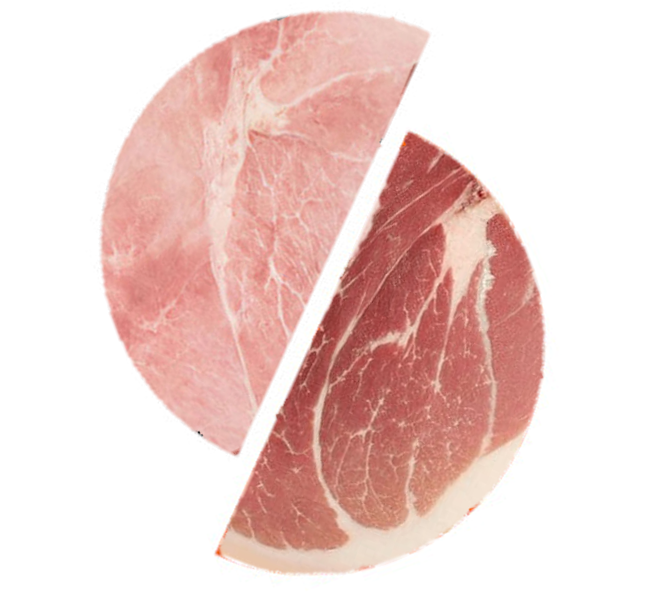

# Prosciutto_Slic3r
Bon appetit ! A tool to compile Mortadella_Slic3r, Bee_Slic3r or SuperSlicer

  

You need 8 Gb of RAM minimum to make it run without any issues
It takes me a bit less than 1h to compile with 6 CPU threads (3.2 GHz) and 8,5 Gb of ram on Virtual box

here you can find Mortadella_Slic3r : https://github.com/melROLL/Mortadella_Slic3r
here you can find Bee_Slic3r : https://github.com/melROLL/Bee_Slic3r
